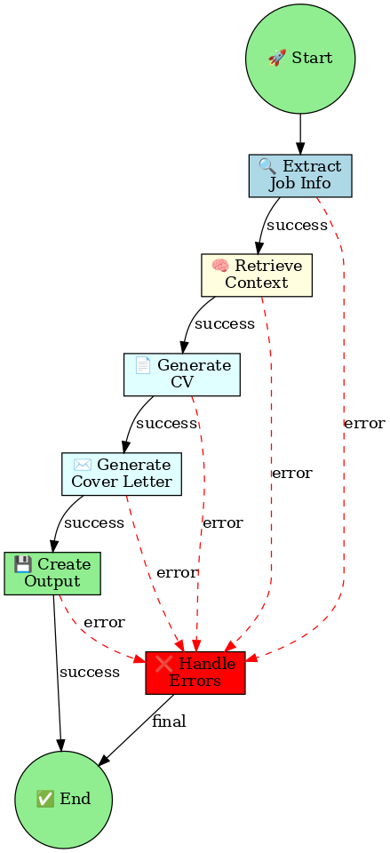

# 🤖 CV Agent - AI-Powered Job Application Assistant

A sophisticated AI system that automatically generates tailored, honest CVs and cover letters for job applications using LangChain/LangGraph and RenderCV. The agent ensures content accuracy by validating all claims against your verified personal data.

## 🏗️ System Architecture



The system follows a structured workflow to create personalized job applications while maintaining honesty and accuracy.

## Features

🤖 **AI-Powered Generation**: Uses advanced RAG (Retrieval-Augmented Generation) to customize your CV and cover letter based on job requirements

🌐 **Multi-Language Support**: Handles job descriptions in English, Swedish, and Chinese with automatic translation

📄 **Professional PDF Output**: Generates high-quality PDF documents using RenderCV's professional templates

📁 **Organized File Management**: Creates structured directories with date-company-jobtitle naming convention

🔍 **Smart Content Extraction**: Automatically extracts job descriptions from LinkedIn, Indeed, Glassdoor, and other job sites

⚡ **LangGraph Orchestration**: Uses LangGraph for reliable, stateful workflow management

## Quick Start

### 1. Installation

```bash
# Install with uv
uv sync

# Set up environment variables
cp .env.example .env
# Edit .env with your actual API keys

# Set up global CV/CL configuration
cp cv_config.yaml cv_config.yaml
# Edit cv_config.yaml to point to your template files
```

### 2. Initialize Your User Profile

```bash
# Initialize user profile and create template files
cv-agent setup-rag "Your Name"

# This creates:
# - users/YourName/ directory structure
# - Default CV template (users/YourName/cv_template.yaml)
# - User-specific configuration (users/YourName/config.yaml)
# - RAG database setup
```

### 3. Add Your Personal Data

```bash
# The setup-rag command creates template files for you
# Edit the generated personal_info.json with your actual information
nano users/YourName/personal_info.json

# Add career documents to users/YourName/career_data/
# (resumes, certificates, performance reviews, etc.)
cp ~/Documents/resume.pdf users/YourName/career_data/

# Add code samples to users/YourName/code_samples/
# (portfolio projects, GitHub repos, etc.)
cp ~/Projects/my-project/ users/YourName/code_samples/
```

The setup-rag command automatically creates:
- ✅ `personal_info.json` - Template with your basic information
- 📁 `career_data/` - Directory for career documents
- 📁 `code_samples/` - Directory for code examples

### 4. Generate Your First Application

```bash
# Generate CV and cover letter for a job posting
cv-agent generate "Your Name" "https://jobs.yazen.com/jobs/6736369-full-stack-engineer?utm_source=LinkedIn"

# Custom output directory
cv-agent generate "Your Name" "https://indeed.com/job/123" --output ./my_applications/
```

## Usage Examples

### Profile Management

```bash
# Initialize a new user profile
cv-agent setup-rag "John Doe"

# Setup RAG database with your career data
cv-agent setup-rag "John Doe" \
  --personal-info ./my_info.json \
  --career-data ./career_docs/ \
  --code-samples ./code/
```

### Job Application Generation

```bash
# Generate application for a LinkedIn job
cv-agent generate "John Doe" "https://linkedin.com/jobs/view/data-scientist-123"

# Use development LLM (fast, cheap)
cv-agent generate "John Doe" "https://linkedin.com/jobs/view/data-scientist-123" --llm-preset dev

# Use production LLM (high quality)
cv-agent generate "John Doe" "https://linkedin.com/jobs/view/data-scientist-123" --llm-preset prod

# With custom output directory
cv-agent generate "John Doe" "https://indeed.com/job/ml-engineer" --output ./my_applications/

# Verbose output for debugging
cv-agent generate "John Doe" "https://glassdoor.com/job/software-architect" --verbose
```

### Configuration Management

```bash
# Create a global configuration file
cv-agent init-config cv-agent-config.yaml

# User-specific configs are created automatically in users/Name/config.yaml
```

### Graph Visualization

```bash
# Display the agent workflow graph in terminal
cv-agent graph

# Save graph as DOT file (requires Python graphviz package)
cv-agent graph --output workflow.dot

# Save graph as PNG image (requires system graphviz tools)
cv-agent graph --output workflow.png

# Install graphviz for visualization
pip install graphviz
```

## Architecture

The CV Agent consists of several key components:

### Core Components

- **Job Extractor**: Scrapes and extracts job descriptions from various job sites
- **Translation Service**: Translates Swedish job descriptions to English
- **RAG System**: Stores and retrieves personal career information using vector search
- **CV Generator**: Customizes RenderCV YAML templates based on job requirements
- **Cover Letter Generator**: Creates tailored cover letters using retrieved context
- **LangGraph Agent**: Orchestrates the entire workflow with state management

### Workflow

1. **User Profile Setup**: Initialize user with personal data and templates
2. **Job Analysis**: Extract and analyze job requirements from LinkedIn URL
3. **Context Retrieval**: Find relevant experience and skills from RAG database
4. **Content Generation**: Generate customized CV and cover letter
5. **Content Validation**: Verify all claims against verified personal data
6. **PDF Creation**: Use RenderCV to create professional PDF documents
7. **File Organization**: Save everything in structured directory format

### 🔒 Content Validation & Honesty

The CV Agent prioritizes **honesty and accuracy**:

- ✅ **Validated Content**: All claims are cross-referenced with your verified RAG database
- 🚫 **No Fabrication**: Prevents AI from inventing experience or skills you don't have
- ⚠️ **Flagged Content**: Potentially unverified claims are flagged for review
- 📝 **Audit Trail**: Validation results are logged for transparency

This ensures your job applications remain ethical and truthful while still being optimized for each position.

## Configuration

The agent uses a **global CV/CL configuration** (`cv_config.yaml`) for templates and a **user-specific configuration** (`users/{Name}/config.yaml`) for personal data.

### Global CV/CL Configuration (`cv_config.yaml`)

Create this file at the repository root:

```yaml
cv:
  template_dir: ./cv_templates
  base_cv_file: ./cv_templates/base_cv.yaml
  theme: classic
cover_letter:
  template_file: ./cv_templates/cover_letter_template.md
output_dir: ./generated_applications
```

### User Configuration (`users/{Name}/config.yaml`)

Each user gets their own configuration for personal settings:

```yaml
user_name: "John Doe"
rag:
  vector_store_path: "./users/JohnDoe/rag_store"
  embedding_model: "text-embedding-3-small"
llm:
  provider: "openrouter"
  model: "anthropic/claude-3.5-sonnet"
  temperature: 0.1
  max_tokens: 4000
translation:
  provider: "google"
  api_key_env_var: "GOOGLE_TRANSLATE_API_KEY"
```

**Note**: CV/CL templates are now managed globally. User configs only contain personal data and preferences.

### Environment Variables

Set up your environment variables by copying the example file:

```bash
cp .env.example .env
# Edit .env with your actual API keys
```

Required environment variables:

```bash
export OPENROUTER_API_KEY="your_openrouter_key"           # Required for LLM
export GOOGLE_TRANSLATE_API_KEY="your_google_translate_key"  # Optional
```

### LLM Model Configuration

Configure your preferred LLM model via environment variables:

```bash
# General settings
export LLM_MODEL="anthropic/claude-3.5-sonnet"     # Default model
export LLM_TEMPERATURE="0.1"                       # Creativity level
export LLM_MAX_TOKENS="4000"                       # Response length

# Development models (fast, cheap)
export LLM_MODEL="meta-llama/llama-3.2-3b-instruct"

# Production models (high quality)
export LLM_MODEL="anthropic/claude-3.5-sonnet"     # Current default
# Alternatives: "openai/gpt-4o", "anthropic/claude-3-haiku"
```

Or use CLI presets:

```bash
# Development preset (fast/cheap)
cv-agent generate "Name" "job_url" --llm-preset dev

# Production preset (high quality)
cv-agent generate "Name" "job_url" --llm-preset prod
```

Get your OpenRouter API key at: https://openrouter.ai/keys

## Supported Job Sites

- LinkedIn Jobs
- Indeed
- Glassdoor
- Generic job posting sites (with fallback extraction)

## Language Support

- **English**: Native support
- **Swedish**: Automatic translation to English for summary
- **Chinese**: Detection and processing support

## Output Structure

Each job application creates a user-specific directory structure:

```
generated_applications/
└── 2024-12-28_TechCorp_SeniorSoftwareEngineer/
    ├── summary.txt              # Job details and extracted information
    ├── CV.pdf                   # Validated, customized resume
    ├── cover_letter.pdf         # Honest, tailored cover letter
    └── validation_log.txt       # Content validation results
```

User data is stored in:

```
users/{UserName}/
├── config.yaml              # User-specific configuration
├── cv_template.yaml         # CV template (auto-created)
├── personal_info.json       # Personal information
├── career_data/             # Career documents
├── code_samples/            # Code samples
└── rag_store/               # Vector database
```

## Requirements

### Dependencies

- Python 3.12+
- RenderCV (for PDF generation)
- LangChain & LangGraph (for AI orchestration)
- OpenAI API access (for embeddings and generation)
- httpx & beautifulsoup4 (for web scraping)
- Various other libraries (see requirements.txt)

### API Keys

Set up your environment variables by copying the example file:

```bash
cp .env.example .env
# Edit .env with your actual API keys
```

Required environment variables:

```bash
export OPENROUTER_API_KEY="your_openrouter_key"           # Required for LLM
export GOOGLE_TRANSLATE_API_KEY="your_google_translate_key"  # Optional
```

Get your OpenRouter API key at: https://openrouter.ai/keys

## Development

### Project Structure

```
cv-agent/
├── main.py                    # CLI entry point
├── agent.py                   # Main agent orchestration
├── langgraph_agent.py         # LangGraph workflow
├── config.py                  # Configuration management
├── job_extractor.py           # Job description extraction
├── translation.py             # Multi-language support
├── rag_system.py              # Vector database management
├── cv_generator.py            # CV customization with validation
├── cover_letter_generator.py  # Cover letter creation with validation
├── utils.py                   # Helper functions
├── RAG_SETUP_GUIDE.md         # Personal data setup guide
├── pyproject.toml             # Project configuration
├── uv.lock                    # Dependency lock file
├── .gitignore                 # Git ignore rules
├── .env.example               # Environment variables template
├── cv_config.yaml              # Global CV/CL configuration template
├── workflow.png               # System architecture diagram
└── users/{UserName}/          # User-specific data (created automatically)
    ├── config.yaml            # User configuration
    ├── cv_template.yaml       # CV template
    ├── personal_info.json     # Personal information
    ├── career_data/           # Career documents
    ├── code_samples/          # Code samples
    ├── rag_store/             # Vector database
    └── generated_applications/# Output applications
```

### Environment Setup

```bash
# Copy environment template
cp .env.example .env

# Edit .env with your actual API keys
# OPENROUTER_API_KEY=your_key_here
# GOOGLE_TRANSLATE_API_KEY=your_key_here
```

### Running Tests

```bash
# Install development dependencies
uv sync --extra dev

# Run tests (when implemented)
pytest tests/
```

### Contributing

1. Fork the repository
2. Create a feature branch
3. Make your changes
4. Add tests if applicable
5. Submit a pull request

## Troubleshooting

### Common Issues

**"OpenRouter API key not found"**
- Copy `.env.example` to `.env` and add your API key
- Ensure `OPENROUTER_API_KEY` is set in your environment
- Get your key at: https://openrouter.ai/keys

**"LLM responses too slow/expensive"**
- Use `--llm-preset dev` for faster, cheaper models during development
- Configure `LLM_MODEL` in your `.env` file to a lighter model
- Try `meta-llama/llama-3.2-3b-instruct` for development

**"LLM responses not good enough"**
- Use `--llm-preset prod` for high-quality models
- Configure `LLM_MODEL` to `anthropic/claude-3.5-sonnet` or `openai/gpt-4o`
- Increase `LLM_TEMPERATURE` slightly for more creative responses

**"Content flagged as unverified"**
- Add the missing experience/skills to your RAG database
- Update your personal_info.json or career data files
- Re-run setup-rag to rebuild the database

**"No relevant experience found"**
- Check your RAG database setup (see RAG_SETUP_GUIDE.md)
- Add more detailed career information to users/{Name}/career_data/

**"RenderCV command not found"**
- Ensure RenderCV is installed: `pip install rendercv[full]`

**"Translation failed"**
- Verify GOOGLE_TRANSLATE_API_KEY is set
- Check internet connection for translation services

**"PDF generation failed"**
- Ensure Typst is installed (RenderCV requirement)
- Check file permissions in output directory

### Debug Mode

Use `--verbose` flag for detailed logging:

```bash
cv-agent generate --verbose "job_url"
```

## License

This project is part of the RenderCV ecosystem. See the main RenderCV repository for licensing information.

## Support

For issues and questions:

1. Check the troubleshooting section above
2. Review the RAG setup guide for data-related issues
3. Check RenderCV documentation for PDF generation issues
4. Open an issue in the repository with detailed information

## ✅ Completed Features

- [x] **User Profile System**: Isolated user data and configurations
- [x] **Content Validation**: Ensures honesty by validating claims against verified data
- [x] **OpenRouter Integration**: Support for multiple LLM providers
- [x] **Graph Visualization**: Visual representation of the agent workflow
- [x] **Automated Template Creation**: Auto-generates CV templates and folder structure

## 🚀 Roadmap

- [ ] Enhanced LLM integration with more providers
- [ ] Web interface for easier management
- [ ] Integration with LinkedIn/Indeed APIs
- [ ] Advanced customization templates
- [ ] Multi-format output (Word, HTML enhanced)
- [ ] Analytics dashboard for application tracking
- [ ] A/B testing for different CV versions
- [ ] Resume optimization scoring

---

**Happy job hunting! 🚀**

The CV Agent helps you put your best foot forward by creating personalized, professional applications tailored to each job opportunity.
